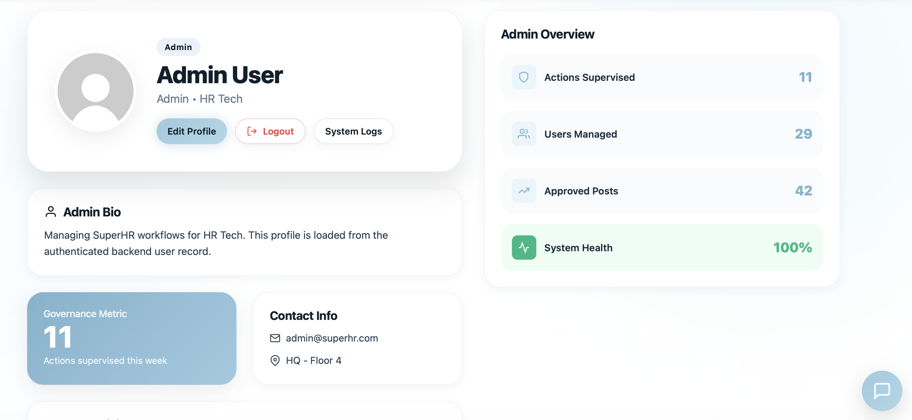
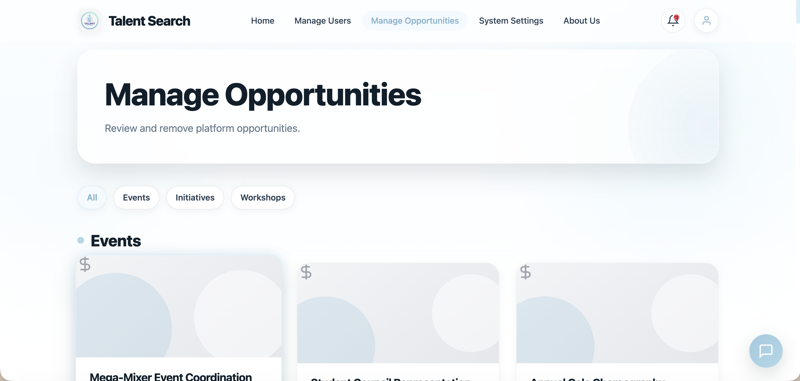
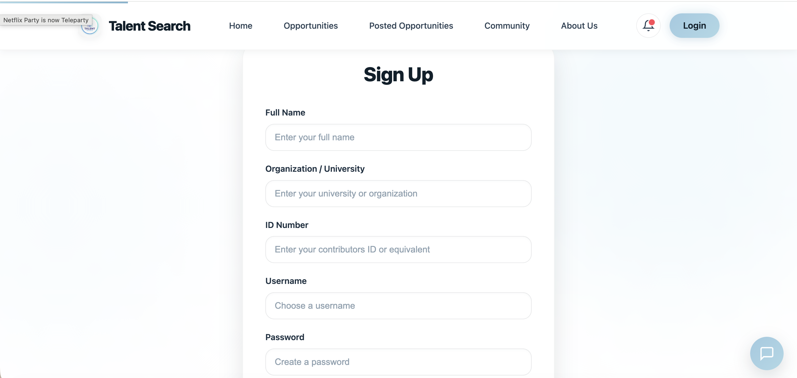

# Talent Search Features

Talent Search is a role-based opportunity discovery and contribution platform for campus or organisation communities. It helps contributors find work, post opportunities, track engagement, collaborate through chat, and lets admins manage their organisation's users and opportunities.

## Product Screenshots

| Area | Screenshot |
| --- | --- |
| Admin profile and organisation metrics |  |
| Admin manage opportunities |  |
| Signup form |  |

## Core User Features

### Authentication and Role Routing

Users can sign up and log in as contributors or admins. After login, the header and home logo route the user to the correct role-specific experience.

- Contributors land in the contributor dashboard.
- Admins land in the admin dashboard.
- Logged-out users see the public home page with Login and Get Involved paths.
- Contributor signup restricts organisation selection to organisations created by admins.
- Admin signup allows free-entry organisation/university names.

### Opportunities Hub

The opportunities hub lists active opportunities and supports skill-based browsing. Event, workshop, and initiative segregation has been removed so users interact with a simpler general opportunity model.

- Browse active opportunities.
- Filter by skill areas.
- View details before applying.
- Mark an opportunity as interested.
- Apply to opportunities.
- Prevent users from applying to their own posted opportunities.
- Hide the “Interested” action when the user already saved that opportunity.

### AI-Assisted Opportunity Posting

The AI assistant can turn a natural language posting request into an editable opportunity draft.

Flow:

1. User asks the assistant to post/create/draft an opportunity.
2. Assistant parses title, description, skills, points, schedule, location, and time commitment.
3. Assistant opens the Post Opportunity page.
4. The form loads with editable prefilled fields.
5. User reviews and clicks one `Post Opportunity` button.

The parser has a fallback path, so draft creation still works when the Groq API is unavailable.

### Post Opportunity Form

The posting page supports both manual and AI-assisted creation.

- Natural language description box.
- AI Generate Details button.
- Voice input for the description field.
- Editable title, description, location, schedule, points, time commitment, and skills.
- One-button final post submission.
- General `Opportunity` type used internally.

### Posted Opportunities

Users can manage opportunities they authored.

- View own posted opportunities.
- Review interested users and applicants.
- See skill-match context for applicant review.
- Remove posted opportunities.

### Contributor Dashboard and Profile

The contributor experience focuses on progress and participation.

- Dashboard summarizes activity and rewards.
- Profile manages user details and skills.
- AI recommendations use profile and opportunity context.
- Rewards are shown as points and can be interpreted through admin reward policy.

## AI Assistant Features

The AI assistant is available across the site through the floating chat button.

- Platform-aware answers for both user and admin flows.
- Context includes role, organisation, visible opportunities, interests, applications, posted opportunities, invitations, community channels, and admin metrics.
- Suggested action buttons can open relevant pages.
- Voice typing support through browser speech recognition.
- Direct opportunity draft creation from chat.
- Fallback responses when model access is unavailable.

## Community Features

Talent Search includes community communication tools.

- Channel-based chat.
- Direct messages.
- Member discovery.
- Collaboration invitations.
- Appointment/invitation flow for scheduling or follow-up.

## Admin Features

Admins operate within their own organisation scope. Admin pages should not show unrelated organisation data.

### Admin Dashboard

The admin dashboard summarizes organisation-specific activity.

- Total users in the admin organisation.
- Active opportunities from that organisation.
- Removed opportunity count.
- Applications and interests.
- Skill and department activity insights.
- Notification data scoped to organisation.

### Manage Users

Admins can manage users from their organisation.

- View organisation users.
- Create users under the admin organisation.
- Update users without moving them outside the admin organisation.
- Remove users.
- Manage reward policy controls.

### Manage Opportunities

Admins can review and remove organisation opportunities.

- View opportunities posted by users in the admin organisation.
- Review engagement counts.
- Remove opportunities when needed.
- No event/workshop/initiative tabs.

### Admin Profile

The admin profile is backend-driven.

- Loads authenticated admin user details.
- Shows organisation-scoped governance metrics.
- Includes logout.
- Links to system logs/activity section.

### System Settings

Admins can manage platform-level toggles.

- Maintenance mode.
- Auto-approve opportunities.
- Public profile setting.
- 2FA requirement flag.
- Session timeout.

## Backend/API Coverage

Implemented API areas include:

- Auth: signup, login, logout, current user.
- Opportunities: browse, detail, create, delete, my posted opportunities.
- Engagement: interested opportunities, applications, status updates.
- Invitations: create, list, update.
- Community: channels, messages, direct messages, members, user search.
- Rewards: reward summary and reward policy.
- Admin: users, profiles, opportunities, dashboard, settings.
- AI: chat, opportunity parsing, matching, suggestions, skill extraction.

See [IMPLEMENTATION_PROGRESS.md](IMPLEMENTATION_PROGRESS.md) for endpoint-level status.

## Demo Media To Add Next

The repository now includes screenshots under `docs/screenshots`. Useful GIFs to add next:

- `docs/gifs/ai-opportunity-draft.gif`: Assistant creates and opens a prefilled opportunity form.
- `docs/gifs/user-apply-flow.gif`: Contributor browses, marks interest, and applies.
- `docs/gifs/admin-org-scope.gif`: Admin dashboard and manage pages showing organisation-scoped data.
- `docs/gifs/community-chat.gif`: Channel chat and direct message flow.

