# Talent Search

Talent Search is a role-based opportunity discovery and collaboration platform built for universities and organisations. It connects contributors with short-term work, lets users post and manage opportunities, gives admins organisation-scoped oversight, and adds an AI layer for navigation, assistance, and opportunity drafting.

This document is structured as a submission-ready feature overview of the current product.

## 1. Product Overview

Talent Search solves a common campus and organisation problem: meaningful work exists, but the right people often do not discover it early enough, and the people managing those opportunities do not have a clean system for visibility, coordination, and follow-through.

The product brings these workflows into one platform:

- onboarding and authentication,
- role-based dashboards,
- opportunity discovery,
- opportunity posting and applicant handling,
- community discussion,
- rewards and participation tracking,
- admin governance,
- and AI-assisted user support.

The platform currently supports three main roles in the backend:

- `contributors`
- `admin`
- `head_of_department`

The implemented user-facing experience is centered primarily around contributor and admin flows.

## 2. Problem Statement

In most universities and internal organisations, opportunities are shared through fragmented systems such as WhatsApp groups, spreadsheets, email threads, and informal referrals. That causes predictable issues:

- contributors miss opportunities relevant to their skills,
- opportunity owners cannot easily track interest and applications,
- collaboration stays disconnected from the opportunity itself,
- and admins do not get clean visibility into activity within their own organisation.

Talent Search addresses this by centralising the full lifecycle:

1. users join the platform,
2. discover opportunities matched to their profile,
3. express interest or apply,
4. collaborate through community messaging,
5. post their own opportunities,
6. and let admins manage the ecosystem for their organisation.

## 3. Public Experience and Authentication

The platform supports both a public entry state and an authenticated role-based experience.

### Public homepage

Logged-out users land on a clean public homepage with a `Get Involved` path and role-aware login entry.

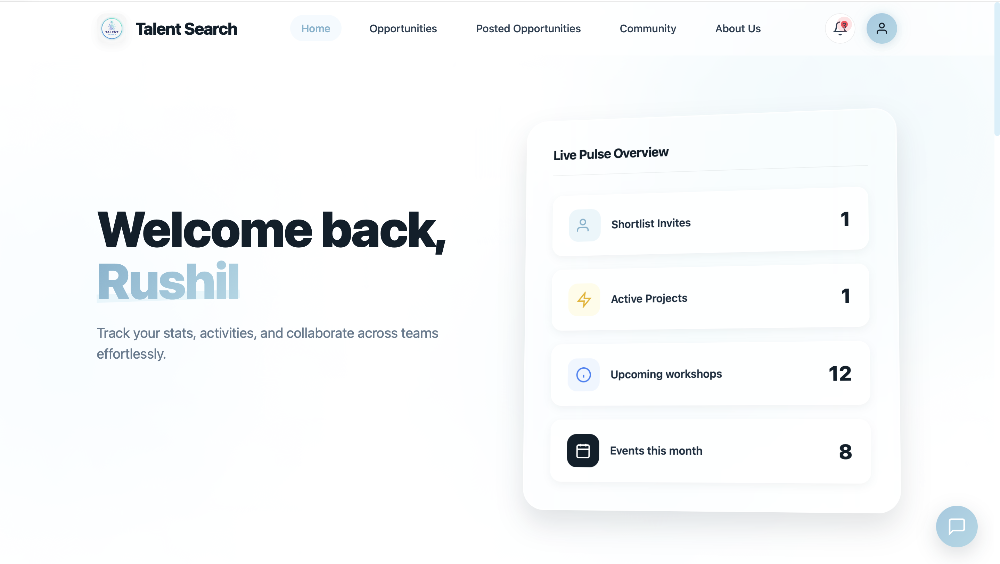

### Login entry point

The login page provides a simple gateway into the authenticated experience. Once authenticated, users are redirected according to role:

- contributors go to the contributor dashboard,
- admins go to the admin dashboard.

Logout returns the user to the public homepage rather than leaving them inside role-specific routes.

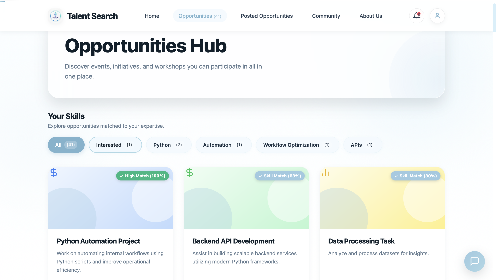

## 4. Signup System

The signup flow is intentionally different for contributors and admins because the platform uses organisation-aware access.

### Contributor signup

Contributor signup does **not** allow arbitrary organisation entry. Contributors must select their university or organisation from approved organisations already created through admin accounts. This ensures contributors join a valid organisation context instead of creating inconsistent free-form records.

### Admin signup

Admin signup keeps organisation entry flexible. An admin can create a new organisation or university name during signup, and that organisation later becomes available in the contributor dropdown.

### Form usability improvements

The detail forms were compacted and converted into a single-column layout so that the signup flow is easier to complete and more consistent across roles.

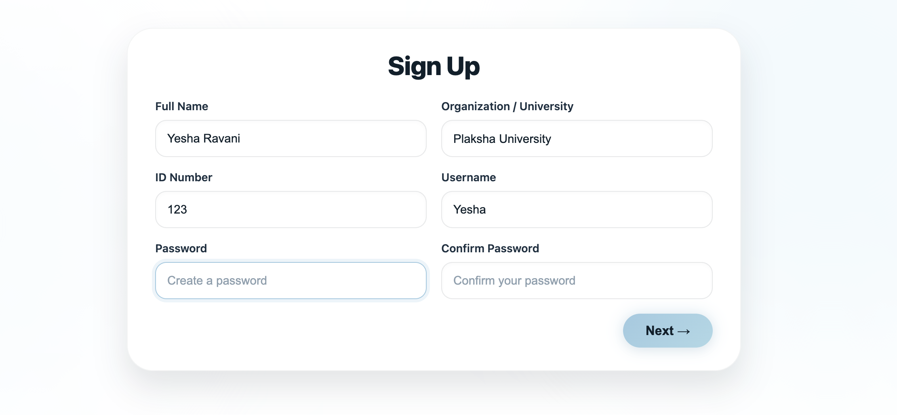

## 5. Contributor Experience

The contributor side of the platform is designed around discovery, participation, collaboration, and profile-based relevance.

### Contributor dashboard

The contributor dashboard is the primary logged-in landing page. It is backend-connected and surfaces user-facing activity instead of acting as a static mock screen.

It highlights:

- welcome state tied to the authenticated user,
- overview cards,
- engagement signals,
- entry points into opportunities and collaboration,
- and notification-driven follow-up actions.

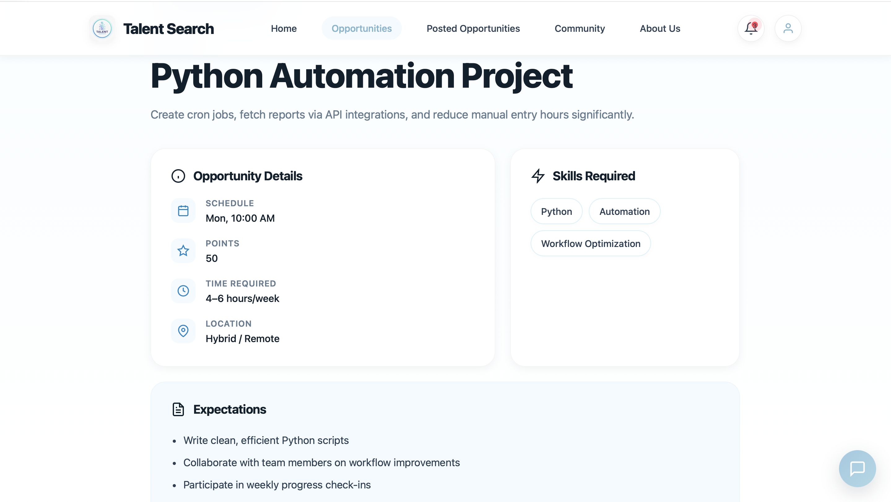

### Contributor profile

The contributor profile acts as both a personal record and a matching signal for the rest of the system.

It includes:

- user identity and organisation information,
- profile completion visibility,
- editable skills,
- preferred domains,
- rewards and performance summaries,
- and profile data that can support opportunity matching and AI context.

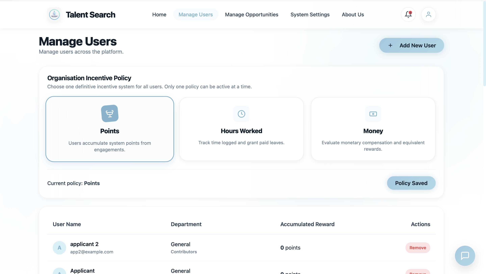

## 6. Opportunity Discovery

One of the core product goals is to make opportunity discovery structured, relevant, and easy to act on.

### Simplified opportunity model

The platform previously had separate segmentation for `Events`, `Initiatives`, and `Workshops`. That segregation has been removed from the user and admin experience. The current product treats posts as general opportunities and uses skills as the main user-facing grouping logic.

This makes the browsing model cleaner:

- users explore opportunities from one hub,
- filtering is based on skill relevance rather than post-type silos,
- and admin moderation no longer has to mirror artificial type buckets.

### Opportunities hub

The opportunities hub is the main discovery page. It shows:

- available opportunities,
- skill-based grouping,
- skill match indicators,
- and direct access into detail pages.

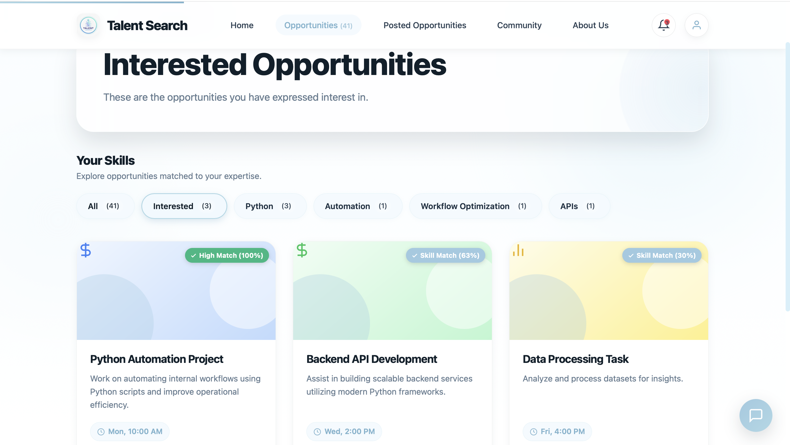

### Opportunity detail page

The detail page is where a user evaluates whether to engage with an opportunity. It surfaces core structured information such as:

- title,
- description,
- schedule,
- reward points,
- time commitment,
- location,
- and required skills.

The page is backend-driven and reflects the current state of the opportunity rather than static hardcoded text.

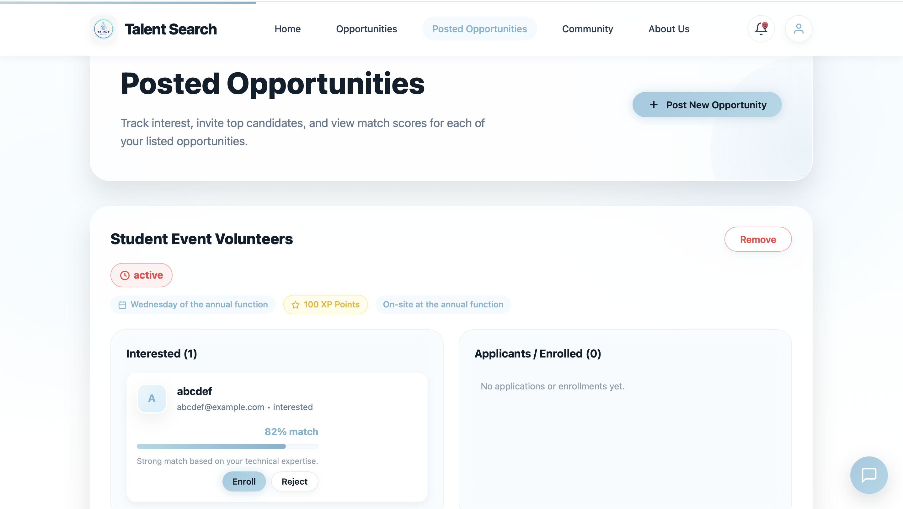

### Interested opportunities

Users can mark opportunities they want to revisit. The interested view collects those opportunities into a dedicated page so that interest can act as a meaningful shortlist rather than a cosmetic toggle.

The logic also includes product guardrails:

- users should not be able to apply to their own opportunities,
- users should not be able to mark their own opportunity as interested,
- and already-interested opportunities should not continue to behave like untouched opportunities.

## 7. Opportunity Posting and Management

Talent Search is not only for discovering work. It also supports full opportunity creation and follow-through.

### Posted opportunities

Users who create opportunities can manage them from a dedicated posted opportunities page.

This page supports:

- reviewing each post,
- seeing interested users,
- seeing applicant state,
- acting on candidate engagement,
- and removing opportunities when appropriate.

This closes the loop between posting work and actually staffing or coordinating it.

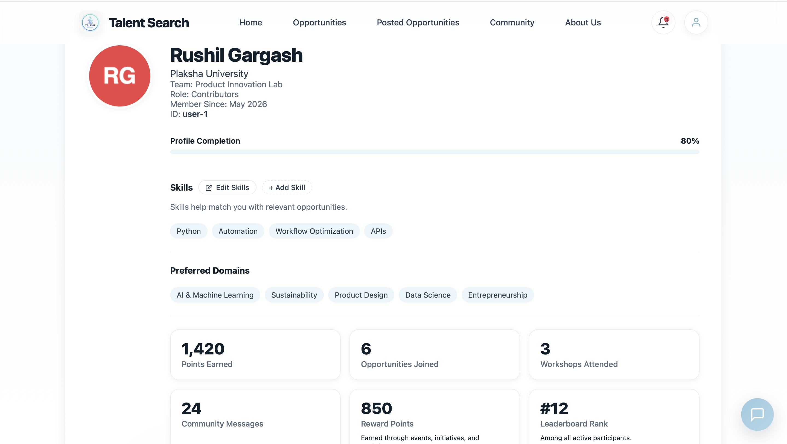

## 8. Community and Collaboration

The platform includes an integrated collaboration layer rather than outsourcing all communication to external apps.

### Community chat

The community module supports:

- broadcast-style channels,
- opportunity-linked or shared discussion spaces,
- direct messages,
- searchable members,
- and ongoing team coordination after opportunity discovery.

The experience is designed to keep users inside the same system once an opportunity leads to collaboration.

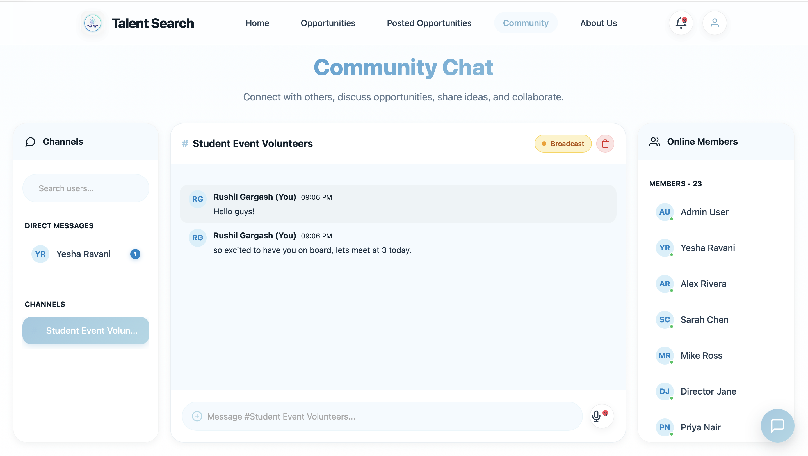

## 9. AI Features

The AI layer is one of the strongest differentiators in the current product. It is intended to be platform-aware rather than a generic disconnected chatbot.

### AI assistant

The assistant is available through the floating chat entry point across the platform. It is designed to answer questions using live product context such as:

- user role,
- organisation,
- visible opportunities,
- applications and interests,
- posted opportunities,
- invitation state,
- community context,
- and admin-facing metrics where relevant.

It can help users with:

- navigation,
- product understanding,
- reward and participation questions,
- opportunity guidance,
- and action suggestions inside the platform.

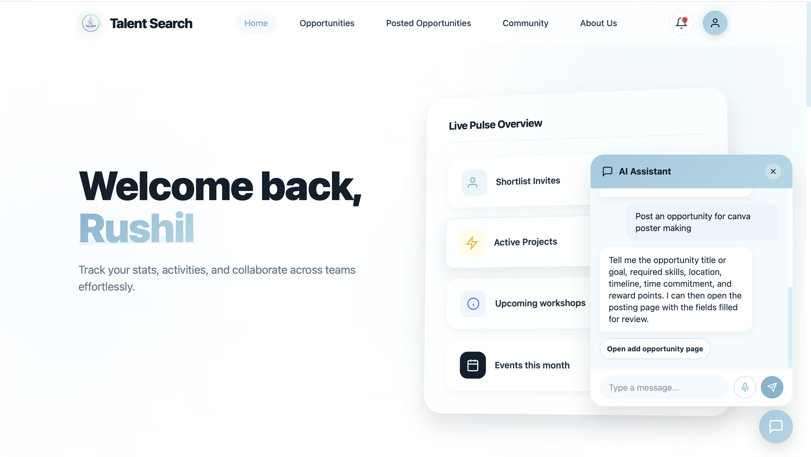

### Voice input

The assistant also supports browser speech-to-text so a user can speak instead of typing. The voice input transcribes into chat and then flows into the same assistant logic.

### AI-assisted opportunity drafting

The most important AI workflow in the product is direct opportunity drafting through natural language.

The intended flow is:

1. the user describes an opportunity in plain language,
2. the system interprets the intent to post an opportunity,
3. the description is parsed into structured fields,
4. the posting page opens with editable prefilled inputs,
5. and the user reviews and publishes through the normal final submission flow.

This reduces friction for non-technical users who know what work needs to be done but do not want to manually structure every form field from scratch.

## 10. Rewards and Participation Tracking

Talent Search includes a reward layer that is part of the working product, not just visual decoration.

Implemented reward-related behavior includes:

- contributor-facing reward visibility,
- dashboard summaries,
- admin-configurable reward policy behavior,
- and support for points-based or other organisational incentive models.

This matters because short-term contribution systems work better when engagement is visible, measurable, and acknowledged.

## 11. Admin Experience

The admin side is designed as an operational layer for organisation oversight rather than a cosmetic second theme.

### Organisation-scoped visibility

One of the most important implementation decisions is admin scoping. An admin should only see data for their own organisation, not the entire global dataset across unrelated organisations.

That organisation scoping now applies across:

- admin dashboard metrics,
- manage users,
- manage opportunities,
- applicant and profile inspection,
- notification counts,
- and related moderation actions.

This is a substantial product feature because it turns the admin model from a global mock admin into an organisation-aware management system.

### Admin dashboard

The admin dashboard provides a backend-connected overview of operational health within the admin's organisation.

It surfaces metrics such as:

- total users,
- active opportunities,
- removed opportunities,
- system health,
- and broader organisation-level activity signals.

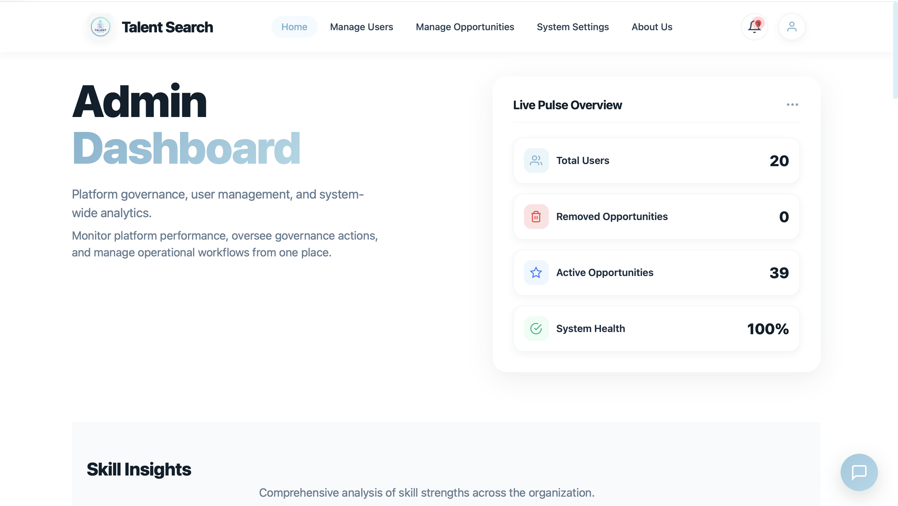

### Manage users

The admin manage users experience supports organisation-specific administration. Admins can:

- review users in their organisation,
- create users,
- remove users,
- and manage policy-related views tied to incentives and rewards.

This page is part of the working governance flow rather than static sample content.

### Manage opportunities

Admins can also review and moderate opportunities created within their organisation.

The admin manage opportunities page focuses on:

- reviewing active opportunities,
- seeing engagement context,
- removing opportunities where needed,
- and managing platform quality from the admin side.

The older separation into events, initiatives, and workshops has been removed here too, keeping the system consistent with the simplified opportunity model.

### Admin profile

The admin profile is backend-linked and reflects authenticated admin data instead of placeholder-only content. It includes:

- admin identity,
- organisation-linked information,
- summary cards,
- profile actions,
- system log access,
- and logout behavior tied to correct public routing.

## 12. Backend and Technical Scope

The product is not a frontend-only prototype. A large part of the value lies in the backend wiring that supports the visible flows.

### Backend stack

The current implementation uses:

- FastAPI,
- SQLAlchemy ORM,
- SQLite for local persistence,
- token-based authentication,
- role-aware routing,
- and backend services for AI parsing and assistant logic.

### Backend-covered feature areas

The implemented API surface includes:

- authentication,
- contributor and admin profile retrieval,
- organisation listing for contributor signup,
- opportunities browse/create/manage flows,
- interested opportunities,
- application and invitation flows,
- reward summaries and policy support,
- admin dashboards and admin management pages,
- community chat and direct message support,
- AI chat,
- AI opportunity parsing,
- AI suggestions,
- skill-related flows,
- and voice or transcription-related assistance paths.

For endpoint-level implementation tracking, see [IMPLEMENTATION_PROGRESS.md](/Users/yesharavani/AI_prod/Talent%20search/SuperHR-TalentSearch/IMPLEMENTATION_PROGRESS.md).

## 13. Current Submission Strengths

From a submission perspective, the strongest aspects of Talent Search are:

1. it covers both contributor and admin journeys in one coherent product,
2. the admin side is organisation-scoped rather than unrealistically global,
3. opportunity posting is supported by AI-assisted drafting,
4. discovery is tied to skills rather than only browsing random cards,
5. collaboration is integrated through community chat,
6. rewards and participation are reflected in the experience,
7. and the system is backed by a working API layer rather than static page transitions alone.

## 14. Remaining Screenshots Worth Adding

The document is now populated with the main contributor, public, AI, community, and admin flow screenshots. The most useful remaining captures for a final polished submission would be:

1. admin system settings page,
2. add opportunity page with AI-prefilled fields visible,
3. and ideally a short GIF of the AI assistant taking a natural language prompt and opening a prefilled opportunity form.

Those additions would strengthen the submission further, but the current document already covers the main implemented experience with embedded visuals.
